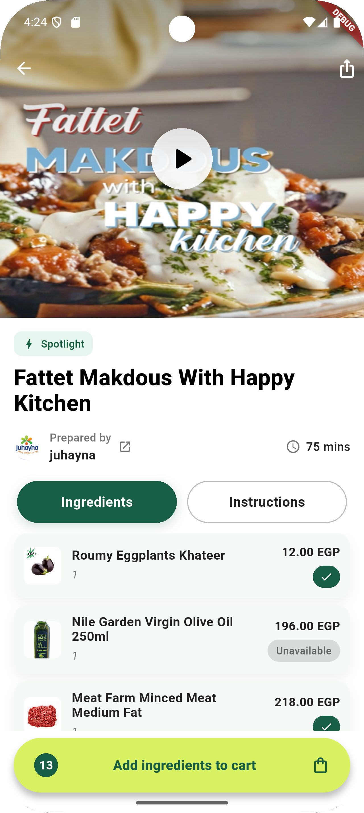
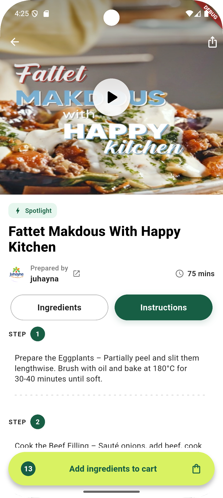

# 🍽️ Recipe App

A Flutter application that displays recipes, categories, and product details.  
This project was built as part of the assignment task using **Flutter**, **Bloc State Management**, and **Clean Architecture principles**.

---

## 📌 Features

- Display list of recipes with categories.  
- Recipe details including:  
  - Ingredients (products with image, name, unit, price).  
  - Cooking steps (with optional step images).  
  - Chef info.  
- Search & filtering by category.  
- Responsive UI with modern design.  
- Bloc for state management.  

---

## 🏛️ Architecture

The project follows **Clean Architecture** with layered structure:

```
lib/
│── core/           # Shared utilities, themes, styles
│── data/           # Data sources, repositories, API models
│── domain/         # Entities, repositories interfaces, use cases
│── presentation/   # UI screens, widgets, Bloc (state management)
```

- **Domain Layer** → Business logic (Entities + Use Cases).  
- **Data Layer** → API/JSON parsing + Repository implementation.  
- **Presentation Layer** → UI + Bloc for state management.  

---

## 🚀 Getting Started

### 1️⃣ Prerequisites
- Flutter SDK (>= 3.0.0)  
- Dart (>= 3.0.0)  

### 2️⃣ Installation
```bash
git clone https://github.com/yourusername/recipe_app.git
cd recipe_app
flutter pub get
```

### 3️⃣ Run the App
```bash
flutter run
```

---

## 📸 Screenshots
```
project-root/
│── lib/
│── screenshots/
│   ├── home.png
│   ├── recipe_details.png
│── README.md
```

```markdown
### 🏠 Home Screen


### 📖 Recipe Details


```

---

## 🛠️ Technologies Used
- **Flutter** (UI framework)  
- **Bloc** (state management)  
- **Dio / Http** (network requests if API used)  
- **json_serializable** (for JSON parsing)  


---
